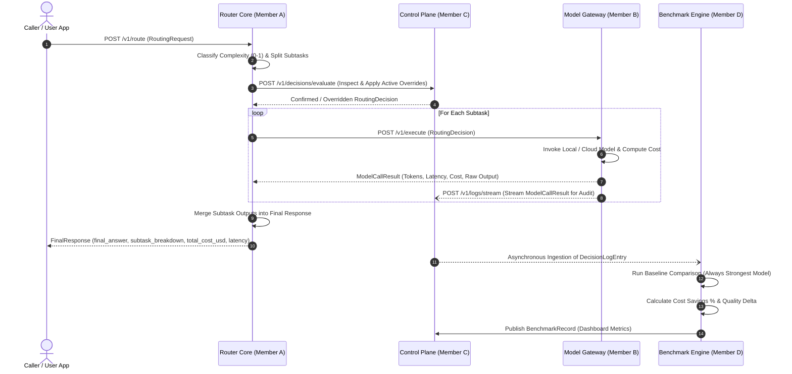

# Cost-LLM System Architecture & Design Specification

**Status:** Scaffolding & Contract Baseline  
**Repository:** `iamthekavin/Cost-LLM`  
**Target Runtime:** Python 3.11, FastAPI, Docker Compose, SQLite / PostgreSQL

---

## 1. Executive Summary

Cost-LLM is an intelligent LLM routing system that sits in front of a heterogeneous cluster of language models spanning different cost, latency, and reasoning capability profiles. Its primary goals are:
1. **Intelligent Complexity Scoring**: Quantify cognitive demand (0.0–1.0) and reasoning depth (`trivial`, `moderate`, `deep`).
2. **Cost-Optimal Routing**: Route requests to the cheapest model capable of correctly satisfying the prompt.
3. **Decomposition & Synthesis**: Break multi-part compound queries into subtasks, distribute subtasks to best-fit models, and merge results into a unified answer.
4. **Auditing & Transparency**: Log every routing decision, model assignment, token count, cost, and rationale.
5. **Control & Policy Overrides**: Support per-request user overrides and admin-level global routing policies.
6. **Objective Benchmarking**: Asynchronously compare router cost against an "always-strongest" baseline (e.g. GPT-4o / Claude 3.5 Sonnet) while proving quality delta is negligible.

---

## 2. High-Level Architecture Diagram

### 2.1 End-to-End System Topology (ASCII)

```
                                  +-----------------------+
                                  |     Caller / Client   |
                                  +-----------------------+
                                     |                 ^
                     RoutingRequest  |                 |  FinalResponse
                                     v                 |
+========================================================================================+
|                                    ROUTER CORE                                         |
|                                                                                        |
|   1. Ingest Prompt / Check Per-Request Overrides                                       |
|   2. Complexity Classifier & Reasoning Depth Scorer                                    |
|   3. Task Decomposer (Split into Subtasks if needed)                                   |
|   4. Policy Matcher (Select Chosen Model & Tier)                                       |
+========================================================================================+
         |                                                       ^
         | RoutingDecision                                       | ModelCallResult
         v                                                       |
+======================+                                +======================+
|    CONTROL PLANE     | -- (Intercept: Policy Override) -> |    MODEL GATEWAY     |
|                      |                                |                      |
| * Policy Evaluation  |                                | * Unified Adapter    |
| * Intercept Override |                                | * Provider Clients:  |
| * Persist Logs:      | <--- (Async Audit Telemetry) -- |   - Local (Ollama)   |
|   DecisionLogEntry   |                                |   - Mid-Tier Hosted  |
| * Admin / User UI    |                                |   - Top-Tier Hosted  |
+======================+                                | * Token & Cost Meter |
         |                                              +======================+
         |
         | Publishes / Stores Audit Logs (DecisionLogEntry)
         v
+========================================================================================+
|                                  BENCHMARK ENGINE                                      |
|                                                                                        |
| * Asynchronous Ingestion of DecisionLogEntry                                           |
| * Evaluates against Baseline Model ("Always Strongest", e.g. GPT-4o)                  |
| * Measures Cost Savings (%) & Quality Delta (+/-)                                      |
| * Persists BenchmarkRecord & Powers Cost-Quality Analytics Dashboard                   |
+========================================================================================+
```

### 2.2 Mermaid Architecture & Interaction Flow



---

## 3. Technology Stack & Justification

| Component | Technology Selected | Justification |
|---|---|---|
| **Programming Language** | **Python 3.11** | Standardizes all 4 team members on a single modern runtime with fast typing, asyncio improvements, and broad LLM SDK support. |
| **API Framework** | **FastAPI + Uvicorn** | High throughput async I/O, automatic OpenAPI / Swagger interactive documentation, and zero-boilerplate Pydantic v2 validation. |
| **Data Contracts** | **Pydantic v2** | Blazing-fast Rust-based serialization/deserialization, strict type constraints, and single-source-of-truth across services. |
| **Local Model Tier** | **Ollama (`llama3.1:8b`)** | Zero marginal API cost, runs locally via Docker or native service, private, fast response for trivial and extractive tasks. |
| **Mid-Tier Hosted** | **`gpt-4o-mini` / `claude-3-5-haiku` / `gemini-1.5-flash`** | Extremely low cost (~$0.15/1M input tokens), high tokens/sec, ideal for moderate reasoning, summarization, and formatting. |
| **Top-Tier Baseline** | **`gpt-4o` / `claude-3-5-sonnet` / `gemini-1.5-pro`** | Gold-standard reasoning. Serves as the objective "always strongest" ceiling to calculate cost savings and prove quality preservation. |
| **Inter-Service Comms** | **Internal HTTP / JSON REST** | Eliminates message broker complexity (no Kafka/RabbitMQ operations needed) while keeping services decoupled and independently testable. |
| **Storage & Persistence** | **SQLite (Dev) / PostgreSQL (Prod via SQLAlchemy)** | SQLite provides instant zero-dependency local setup. SQLAlchemy abstract models enable a single-variable switch to Postgres in production. |

---

## 4. Service Boundaries & Responsibilities

### 4.1 Router Core (`router-core/`) — Member A
- **Ingestion**: Accepts `RoutingRequest` from callers.
- **Classification**: Analyzes semantic complexity, token count, reasoning depth (`trivial`, `moderate`, `deep`).
- **Decomposition**: Identifies multi-part prompts and decomposes them into discrete `SubtaskPrompt` units.
- **Routing Engine**: Matches subtasks against model tiers and budget/quality constraints.
- **Merger**: Synthesizes individual `ModelCallResult` outputs into a coherent `FinalResponse`.
- **Port:** `8001`

### 4.2 Model Gateway (`model-gateway/`) — Member B
- **Unified Adapter**: Abstracts provider nuances behind a single interface (`POST /v1/execute`).
- **Model Connectors**:
  - `OllamaClient`: Talks to local Ollama daemon (`http://localhost:11434`).
  - `OpenAIClient`, `AnthropicClient`, `GoogleClient`: Standardized client adapters.
- **Token & Cost Metering**: Accurately counts input/output tokens and applies real-time pricing models.
- **Error Handling & Retries**: Handles provider timeouts and fallback dispatch.
- **Port:** `8002`

### 4.3 Control Plane (`control-plane/`) — Member C
- **Audit Logging**: Ingests and stores every `DecisionLogEntry` into SQLite/Postgres.
- **Transparency API**: Endpoints to query decision traces by `request_id` or `user_id`.
- **Override Engine**: Dynamic rules to force specific models (e.g., based on user tier, regex prompt matching, or emergency cost caps).
- **Admin Dashboard**: Visual dashboard displaying live routing decisions, token usage, cost breakdowns, and override controls.
- **Port:** `8003`

### 4.4 Benchmark Engine (`benchmark/`) — Member D
- **Asynchronous Evaluation**: Pulls or receives `DecisionLogEntry` records for evaluation.
- **Baseline Shadow Runner**: Re-executes or models prompts through the top-tier baseline model (`gpt-4o`).
- **Metric Computation**:
  - Cost Savings Percentage: `((baseline_cost - router_cost) / baseline_cost) * 100`
  - Quality Delta: Compares outputs using automated judge or heuristic quality metrics.
- **Analytics Store & Reports**: Writes `BenchmarkRecord` entries and generates periodic benchmark reports.
- **Port:** `8004`

---

## 5. Resilience, Fallbacks & Error Handling

1. **Local Model Failure**: If Ollama is unreachable or times out, Router Core / Model Gateway automatically falls back to the mid-tier hosted model (`fallback_model` in `RoutingDecision`).
2. **Provider Rate Limiting**: Model Gateway catches HTTP 429 errors and retries with exponential backoff or fails over to designated alternative tier.
3. **Partial Subtask Failures**: If one subtask in a decomposed request fails, Router Core merges the available results with explicit subtask error notifications rather than failing the entire request.
